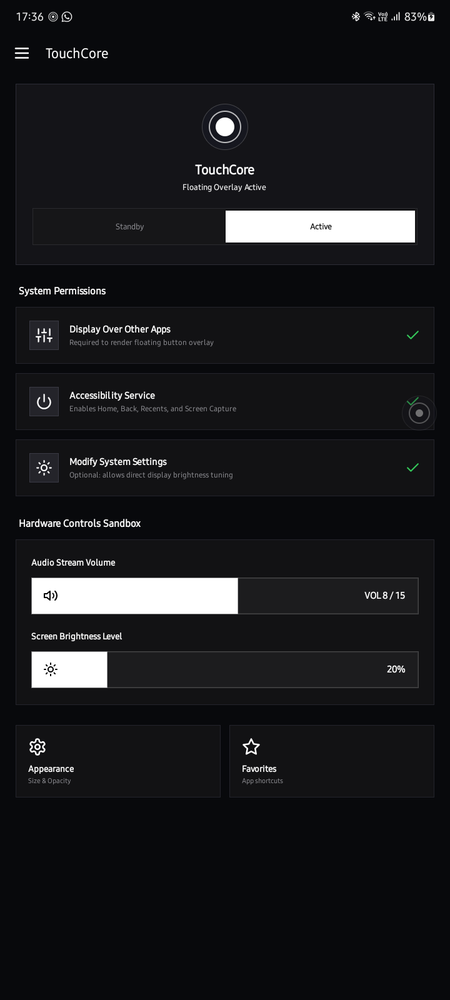
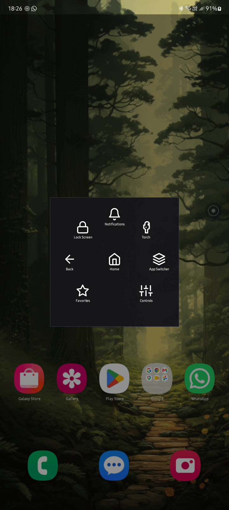
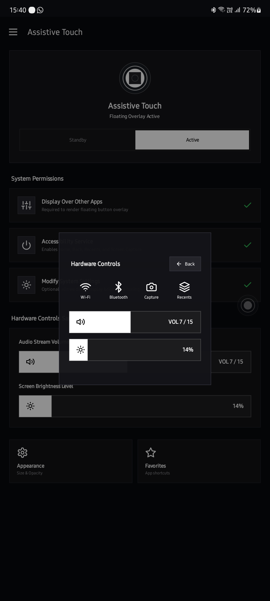
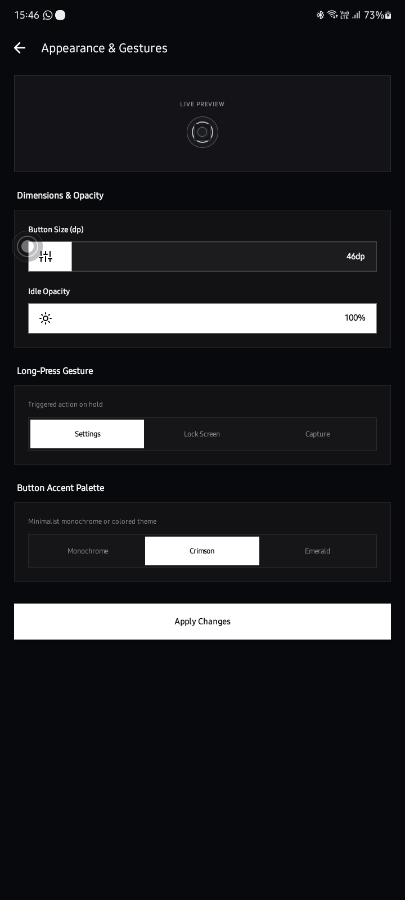

# TouchCore

<div align="center">

**Ultra-lightweight, brutalist floating assistive touch overlay and navigation hub for Android.**

[](LICENSE)
[](https://kotlinlang.org/)
[](https://developer.android.com/about/versions/10)
[](https://developer.android.com/about/versions/15)
[](app/build/outputs/apk/release/)
[](#permissions--security)
[](#permissions--security)

</div>

---

## ◈ Interface Showcase

<div align="center">
  <table>
    <tr>
      <td align="center" width="25%">
        <br/>
        <b>Dashboard</b><br/>
        <sub>Brutalist control center & sliders</sub>
      </td>
      <td align="center" width="25%">
        <br/>
        <b>Action Modal</b><br/>
        <sub>Brutalist 8-action navigation hub</sub>
      </td>
      <td align="center" width="25%">
        <br/>
        <b>Hardware Controls</b><br/>
        <sub>Interactive volume & brightness cards</sub>
      </td>
      <td align="center" width="25%">
        <br/>
        <b>Preferences</b><br/>
        <sub>Live concentric preview & 0dp theme</sub>
      </td>
    </tr>
  </table>
</div>

---

## ◈ About TouchCore

**TouchCore** is a free, open-source alternative to Apple's AssistiveTouch and bulky third-party Android overlay utilities. Built from scratch with Kotlin and clean architecture, TouchCore pairs a concentric circular floating bubble with a minimalist, high-contrast, brutalist interface.

Unlike generic overlay apps that bloat your device with advertisements, aggressive tracking SDKs, and 50MB+ download sizes, TouchCore weighs in at just **2.5 MB**, operates **100% offline**, and requests only the minimal permissions required to function.

* **Zero Ads** - No banners, no interstitials, no rewarded ads, ever.
* **Zero Telemetry** - No analytics, crash reporters, or background trackers.
* **Zero Internet Access** - `android.permission.INTERNET` is not even present in the manifest.

---

## ◈ Features

### ◆ Authentic Concentric Floating Core
* **Concentric Circular Geometry**: Distinctive multi-ring floating trigger designed for tactile feedback.
* **Natural Dragging Physics**: Smooth edge snapping with smart boundary and status-bar avoidance.
* **Idle Auto-Dimming**: Automatically fades to configurable idle opacity (default 40%) when inactive to eliminate distraction.
* **Custom Sizing & Alpha**: Tailor core diameter (40–80 dp) and active/idle opacity levels directly from settings.

### ◆ Global System Navigation
* **Accessibility Hub**: Instant triggers for **Home**, **Back**, **Recents (Overview)**, **Lock Screen**, **Screenshot**, and **Notification Shade**.
* **Zero Lag Dispatch**: Dispatched directly through Android's Accessibility Service framework without unnecessary indirection.

### ◆ Interactive Hardware Controls
* **Direct Volume Card**: Live volume slider with instant audio stream adjustments.
* **Direct Brightness Card**: Live brightness slider with fine-grained adjustment.
* **Flashlight / Torch**: Instant toggle using camera flash hardware.
* **Network & Radio Shortcuts**: Quick jump cards for Wi-Fi and Bluetooth system panels.
* **Orientation & Screen Lock**: Fast orientation lock and display sleep toggles.

### ◆ Pinned App Favorites
* **Fast App Launching**: Pin frequently used apps to the action menu slots for instant launching over any foreground application.

### ◆ Zero-Radius Brutalist Design
* **Brutalist 0dp Radius**: Completely unrounded, sharp border radii on cards, buttons, dialogs, and control sheets.
* **Obsidian OLED Palette**: Deep black (`#101216`) backgrounds, high-contrast white typography, and functional accent highlights.
* **Lucide Iconography**: Unified, clean vector stroke icons for every action and tool.

### ◆ Ultra-Lightweight Footprint
* **2.5 MB Total APK**: Aggressive R8 bytecode optimization and unused resource stripping.
* **Memory Efficient**: Negligible RAM consumption with immediate bitmap recycling and hardware acceleration.

---

## ◈ Permissions & Security

TouchCore follows the principle of least privilege:

| Permission | Status | Purpose |
| :--- | :---: | :--- |
| `SYSTEM_ALERT_WINDOW` | Required | Render the floating touch core and overlay panels above other apps. |
| `BIND_ACCESSIBILITY_SERVICE` | Required | Execute navigation actions (Home, Back, Recents, Lock, Screenshot). Strictly local and unexported. |
| `WRITE_SETTINGS` | Optional | Adjust system screen brightness directly from the touch slider. |
| `CAMERA` | Optional | Toggle camera LED hardware as a torch / flashlight. |
| `FOREGROUND_SERVICE` | Required | Keep the overlay service alive and responsive in the background. |
| `FOREGROUND_SERVICE_MEDIA_PROJECTION` | Optional | Screen recording engine via native MediaProjection APIs. |
| `POST_NOTIFICATIONS` | Required | Display the persistent foreground notification required by modern Android versions. |
| `INTERNET` | **NOT REQUESTED** | **Zero network permissions.** The app cannot make or receive network calls. |

> **Note on Android 13+ Restricted Settings**:
> When sideloading on Android 13 or later, Android may initially restrict accessibility permissions for sideloaded APKs. To enable:
> Go to **App Info** → Tap the **Three Dots (⋮)** in the top right → Select **Allow restricted settings** → Return to Settings and enable the Accessibility Service.

---

## ◈ Architecture

TouchCore is architected around clean architecture, decoupled responsibilities, and testability:

```text
app/src/main/java/com/example/assistivetouch/
├── action/              # Decoupled action dispatcher & executor
│   ├── ActionDispatcher.kt
│   └── ActionExecutor.kt
├── model/               # Immutable models & domain state
│   ├── AssistiveAction.kt
│   ├── AssistiveItem.kt
│   └── MenuPage.kt
├── repository/          # Dynamic menu composition & page graphs
│   └── MenuRepository.kt
├── prefs/               # Local SharedPreferences & favorites storage
│   └── FavoritesManager.kt
├── service/             # Window management & system hooks
│   ├── FloatingButtonService.kt
│   ├── MyAccessibilityService.kt
│   └── ScreenRecordingService.kt
└── ui/                  # Activities, custom views, and canvas widgets
    ├── MainActivity.kt
    ├── SettingsActivity.kt
    ├── FavoritesActivity.kt
    ├── WelcomeActivity.kt
    └── view/
        ├── AssistiveRadialMenuView.kt
        ├── CapsuleSliderView.kt
        └── PillSegmentedGroup.kt
```

---

## ◈ Building from Source

### Prerequisites
* **JDK 17**
* **Android SDK** with Platform Tools for API 35 (Android 15)
* **Gradle Wrapper** (included)

### Build Commands

```bash
# Clone the repository
git clone https://github.com/Xdashio/Touch-Core.git
cd Touch-Core

# Build Debug APK
./gradlew assembleDebug

# Build Optimized Release APK (2.5 MB)
./gradlew assembleRelease

# Run Unit Tests
./gradlew test
```

### Installation via ADB
```bash
adb install -r app/build/outputs/apk/release/app-release.apk
```

---

## ◈ Contributing & Help Wanted

Contributions are warmly welcome. Please review [CONTRIBUTING.md](CONTRIBUTING.md) for development setup, architectural guidelines, and pull request steps.

### ▸ Help Wanted: Universal Screen Recording Engine
We are actively seeking contributors to help build and optimize a **rock-solid screen recording feature** that works reliably across all Android devices and OEM skins without restrictions. If you have experience with Android `MediaProjection`, hardware video encoding (`MediaCodec` / `MediaRecorder`), or foreground capture services, come join the project and help make TouchCore even better!

---

## ◈ License

TouchCore is open-source software licensed under the [Apache License, Version 2.0](LICENSE).
